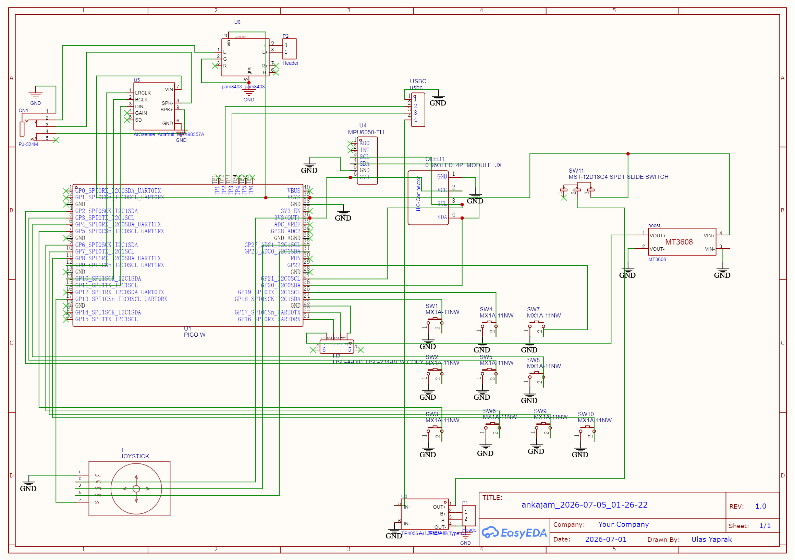

# 🎹 Anka-Jam: The CircuitPython Groovebox

> **Seven buttons. Infinite possibilities. Zero wrong notes.**

Anka-Jam is a portable, standalone hardware synthesizer, 4-track step sequencer, and groovebox powered by the **Raspberry Pi Pico 2 (RP2350)** and CircuitPython's `synthio` library. Designed for tactile live performance, it features a built-in music theory engine, physical pitch-bending via an onboard gyroscope, external USB MIDI keyboard hosting, and a robust 4-track audio engine with independent volume control.

---

## 📑 Table of Contents
1. [Quick Start: How It Works](#-quick-start-how-it-works)
2. [Key Features](#-key-features)
3. [Hardware Requirements & Wiring](#-hardware-requirements--wiring)
4. [Software Installation](#-software-installation)
5. [The Joystick & Chord Shaping](#-the-joystick--chord-shaping)
6. [Play Modes](#-play-modes)
7. [Menus & Effects](#-menus--effects)
8. [The 4-Track Sequencer & Looper](#-the-4-track-sequencer--looper)
9. [Built-in Games](#-built-in-games)
10. [USB MIDI Keyboard Host](#-usb-midi-keyboard-host)
11. [Controls Cheat Sheet](#-controls-cheat-sheet)
12. [License](#-license)

---

## 🚀 Quick Start: How It Works

You don't need to know music theory to play Anka-Jam. The hardware is designed to keep you perfectly in key, always. Turn it on, pick a sound, and press any button.

### 1. The 7 Chord Buttons
The 7 main arcade buttons represent the diatonic scale of your current key. Press them in any order, and they will always sound good together. Each button has a specific musical role:

* **1 (Home):** Major — Your stable home base.
* **2 (Soft):** Minor — Gentle and forward-moving.
* **3 (Dark):** Minor — Moody and emotional.
* **4 (Lift):** Major — Open, bright, and floating.
* **5 (Tension):** Major — High energy, wants to pull you back to Home.
* **6 (Emotional):** Minor — The classic melancholy chord used in modern pop.
* **7 (Suspense):** Diminished — Tense, unresolved, and cinematic.

> 💡 **Try this:** Press **1 → 5 → 6 → 4**. That's the most popular chord progression in pop music. You'll recognize it from hundreds of songs.

### 2. The Joystick (Shape Your Chords)
While holding a chord button, push the analog joystick in any direction to instantly change the chord's "flavor."

* **Up:** Flips Major to Minor (or Minor to Major).
* **Right:** Adds a smooth, Jazzy 7th.
* **Down:** Creates an open, unresolved Sus4.
* **Up-Right:** Adds a bluesy Dominant 7th.

Let go of the joystick, and the chord instantly snaps back to its default state.

### 3. The Physical Pitch Bend (Lead Mode)
Switch to **LEAD** mode, play a note, and literally tilt the entire groovebox like a steering wheel. The built-in MPU-6500 accelerometer acts as a physical whammy bar, letting you bend pitches smoothly up and down by a full step (two semitones) just by turning the device in the air.

### 4. Record, Layer, & Loop
Click the Joystick down like a button to open the looper. Record a chord progression on Track 1, switch your sound to lay down a beat on Track 2, and switch to a synth lead to solo over the top on Track 3. Build a massive 4-track arrangement without ever looking at a computer screen.

---

## ✨ Key Features

* **Advanced Audio Engine:** Powered by `synthio`. Features custom ADSR envelopes, LFOs, Delay, Chorus, Tremolo, and Portamento (Glide).
* **4-Track Step Sequencer & Looper:** Record live loops or program steps on a 16-to-64 step grid across 4 independent tracks. Includes a dedicated Drum engine.
* **Master Mixer & Volume Controls:** Built-in digital mixer screen to adjust the volume levels and mute states of each of your 4 sequencer tracks and your live performance track independently.
* **Music Theory Engine:** 7 physical piano-key buttons mapped intelligently to 10 musical scales.
* **Physical Pitch Bending:** Built-in MPU-6500 accelerometer allows you to physically tilt the device in LEAD mode for expressive, guitar-style whammy bar pitch bends.
* **8 Performance Modes:** Oneshot, Strum, Arpeggio, Psych, Drum, Drone, Repeat, and Lead.
* **USB Host Support:** Plug in a class-compliant USB MIDI keyboard to play Anka-Jam headless or as an external sound module.
* **Mini-Games:** Includes "Hero-Jam" (a falling-note rhythm game based on tab files) and a built-in Ear Trainer.

---

## 🛠️ Hardware Requirements & Wiring

To build Anka-Jam, you will need:
* **Microcontroller:** Raspberry Pi Pico 2 (RP2350)
* **Audio:** MAX98357A I2S Class-D Amplifier Breakout + 3W Speaker
* **Display:** 128x64 OLED Display (SSD1306 via I2C)
* **Sensor:** MPU-6500 / MPU-6050 Accelerometer Breakout (I2C)
* **Inputs:** * 7x Mechanical/Arcade Buttons (Note Keys)
    * 3x Mechanical Buttons (Function Keys: Fn1, Fn2, Fn3)
    * 1x Analog Joystick with Z-Axis click
* **Power:** TP4056 Charge Controller, 18650 Li-ion Battery, and an SPDT/SPST Slide Switch.
* **Connectivity:** USB-C Breakout (power/charging), USB-A female breakout (MIDI Hosting).

### 🔌 Complete Wiring Map
Anka-Jam uses a highly optimized physical wiring cluster for easy header soldering.

#### 1. Power Routing
* **Battery:** Connect the 3.7V Li-ion battery to the `B+` and `B-` pads of the TP4056.
* **Main Switch:** Connect the TP4056 `OUT+` pad to the middle pin of your Power Switch. Connect one of the outer pins of the switch to the Pico's `VSYS` (Pin 39).
* **Ground:** Connect the TP4056 `OUT-` pad to any Pico `GND` pin.

> ⚠️ **Note:** Do NOT power the Pico directly from the battery without the switch, or it will never turn off!

#### 2. Data & Peripherals

| Component | Function | Pico Pin |
| :--- | :--- | :--- |
| **I2S Audio Amp** | BCLK, LRCLK, DIN | GP2, GP3, GP4 |
| **Amp Power** | VIN, GND | VSYS, GND |
| **I2C Bus (OLED & MPU)** | SDA, SCL | GP20, GP21 |
| **I2C Power** | VCC, GND | 3V3(OUT) Pin 36, GND |
| **USB MIDI Host** | D+, D-, VBUS | GP16, GP17, VBUS |
| **Note Buttons 1-7** | Digital In (Pull-Up) | GP9, GP6, GP10, GP7, GP11, GP8, GP12 |
| **Fn Buttons 1-3** | Digital In (Pull-Up) | GP18, GP19, GP22 |
| **Analog Joystick** | X-Axis, Y-Axis | GP26 (ADC0), GP27 (ADC1) |
| **Joystick Click** | Digital In (Pull-Up) | GP13 |

> *(Note: Wire the other side of all buttons and the joystick directly to a common Ground).*

---

## 💻 Software Installation

1. Install **CircuitPython 10.x** on your Raspberry Pi Pico 2.
2. Copy the following required libraries from the Adafruit CircuitPython Bundle to your `lib` folder:
    * `adafruit_display_text`
    * `adafruit_displayio_ssd1306`
    * `adafruit_midi`
    * `adafruit_usb_host_midi`
    * `adafruit_bus_device`
3. Copy the Anka-Jam project files to the root of the Pico drive:
    * `code.py` (Main firmware)
    * `/lib/ankajam_hardware.py` (Hardware definitions & UI)
    * `/lib/ankajam_theory.py` (Music theory & chord math)
    * `/lib/ankajam_synth.py` (Audio generation)
    * `/tabs/` (Folder containing `.json` song files for Hero-Jam)

### 🧠 The MPU-6500 Bypass Hack
**Note for developers:** Anka-Jam uses a custom, bare-metal struct-based I2C driver for the accelerometer to bypass counterfeit MPU-6050s and ensure 30FPS hardware tilt-reading without locking up the OLED display bus.

---

## 🕹️ The Joystick & Chord Shaping

This is where it gets expressive. Hold a Chord Button, push the joystick in any direction, and the chord changes character.

| Direction | Chord Change | What it does (theory) | Example in C |
| :---: | :--- | :--- | :--- |
| **↑ Up** | Maj ↔ Min | Flips the 3rd. Changes the chord's emotional character between bright and dark. | C → Cm |
| **↗ Up-Right** | Dom7 | Adds a flatted 7th. Creates bluesy tension that wants to resolve. | C → C7 |
| **→ Right** | Maj7 / min7 | Adds the natural 7th. Gives a smooth jazz feel or mellow warmth. | C → CMaj7 |
| **↘ Down-Right** | 9th | Adds the 9th. Makes chords sound modern and colorful. | C → Cadd9 |
| **↓ Down** | Sus4 | Replaces the 3rd with the 4th. Creates an open, unresolved sound. | C → Csus4 |
| **↙ Down-Left** | 6th / Sus2 | Adds the 6th note for a sweet, nostalgic quality. | C → C6 |
| **← Left** | Dim / Min | Makes the chord darker. Major becomes minor, minor becomes diminished. | C → Cm |
| **↖ Up-Left** | Aug | Raises the 5th by a half step. Creates a floating, unresolved, dreamy quality. | C → Caug |

> 💡 Toggle Joystick Modes between **Default**, **Extended**, and **Chromatic** by holding **Fn2** and clicking the Joystick.

---

## 🎭 Play Modes

Hold **Fn1** and push the Joystick **Left/Right** to cycle through the 8 instrument modes.

* **ONESHOT:** The default mode. Press a button to play a polyphonic chord.
* **STRUM:** Notes roll out one by one, like strumming a guitar.
* **ARPEGGIO:** Chord notes play one at a time automatically, synced to the BPM.
* **PSYCH:** Modulates the LFO rate with the joystick X-axis, and Filter cutoff with the Y-axis.
* **DRUM:** Transforms the 7 buttons into a drum kit (Kick, Snare, Hat, Tom, Ride, Crash, Clap).
* **DRONE:** Press a chord once, and it sustains infinitely until you press another. Perfect for ambient pads.
* **REPEAT:** The full chord pulses on/off rhythmically like a gate effect.
* **LEAD:** Monophonic mode. Plays only the root note of the chord. Tilt the device to physically pitch-bend the note!

---

## 🎛️ Menus & Effects

To open the main menu, press and hold the **Joystick click for 0.6 seconds**. Push the joystick **Up/Down** to navigate, and **Right/Left** to change values.

### The Menu Tree
* **ADSR:** Change Envelope Presets (Keys, Pad, Pluck, Swell) or manually adjust Attack, Decay, Sustain, and Release times.
* **EFFECTS:** * *Chorus:* Shimmering stereo width.
    * *Delay:* Echoes synced to BPM (1/4, 1/8, 1/16).
    * *Glide:* Portamento slide time (great for Lead mode).
    * *LFO Rate & Tremolo:* Wobble and pulsing effects.
    * *V-Lead:* Toggles Voice Leading (inversions automatically stay close together).
* **JAM:** Adjust quantization grid, load Tab files, or start Auto-progressions.
* **SCALE:** Change the global scale (Major, Natural Minor, Harmonic Minor, Melodic Minor, Pentatonics, Blues, Dorian, Mixolydian, Lydian).
* **SYS:** Toggle MIDI Out over USB, or enable the Metronome click/LED.
* **GAMES:** Launch Hero-Jam or Ear Trainer.

---

## 🎚️ The 4-Track Sequencer & Looper

Anka-Jam features a 4-track engine that can be used as a live looper OR a programmed step sequencer.

### Live Looper Mode
1. **Click the Joystick:** Screen shows `WAIT`.
2. Push Joystick **Left/Right** to choose a fixed loop length (1-8 bars) or leave it at 0 for free-form.
3. **Click again:** Recording starts (`REC`). Play your chords!
4. **Click again:** Stops recording, immediately loops playback.
5. **Overdub:** Click again while playing to layer more notes onto the same track.
6. **Switch Tracks:** Hold **Fn1 + Press Note 1, 2, 3, or 4**. Change your sound, and record a new layer!

### Step Sequencer Mode
* **Enter Step Mode:** Hold **Fn1 + Press Note 7**. The screen changes to a 16-step grid.
* **Navigate:** Hold **Fn3 + push Joystick Left/Right** to move the cursor.
* **Add Notes:** Press any of the 7 Chord buttons to drop that chord onto the grid. (It saves your joystick modifications too!)
* **Change Length:** Hold **Fn2 + Press Note 1, 2, 3, or 4** to expand the track to 16, 32, 48, or 64 steps.
* **Play:** Click the joystick to start playback.

### The Master Mixer
Hold **Fn3 + Press Note 7** to open the Mixer. Here you can see the volume levels of all 4 tracks plus your Live playing.

* Joystick **Left/Right** selects the track.
* Joystick **Up/Down** adjusts the volume.
* Hold **Fn3 + Press a Note button (1-4)** to quickly Mute/Unmute tracks on the fly.

---

## 🕹️ Built-in Games

Anka-Jam isn't just an instrument; it's a console.

### 🎸 Hero-Jam
A falling-note rhythm game.
1. Enter the **Menu -> GAMES -> HERO-JAM**.
2. Select a song from your `/tabs/` folder using the joystick.
3. Click to start. Notes fall down the screen across 7 lanes.
4. Press the corresponding hardware button exactly when the note hits the bottom line to score points and build your combo multiplier!

### 👂 Ear Trainer
1. Enter the **Menu -> GAMES -> EAR TRAIN**.
2. The device will play the root note, then play a mystery chord.
3. Press the hardware button (1-7) you think matches the chord to test your musical ear.

---

## 🎹 USB MIDI Keyboard Host

Anka-Jam acts as a USB Host! Plug a class-compliant USB MIDI keyboard (via an OTG adapter) directly into the Anka-Jam.

* Play the Anka-Jam's internal synthesizer engine using real piano keys.
* The Mod Wheel controls emergency exits from headless mode.
* The keyboard's velocity is mapped to the internal synth engine.
* **Headless Mode:** Hold **Fn2 + Press Note 6** to enter "High Perf Headless" mode, giving maximum CPU priority to USB keyboard scanning for ultra-low latency playing.

---

## ⌨️ Controls Cheat Sheet

| Action | Command |
| :--- | :--- |
| **Open Menu** | Hold Joy Click (> 0.6s) |
| **PANIC (Kill Sound)** | Hold Fn1 + Fn2 + Fn3 |
| **Save State to Memory** | Hold Fn1 + Tap Joy Click |
| **Change Key** | Hold Fn1 + Joy Up/Down |
| **Change Mode** | Hold Fn1 + Joy Left/Right |
| **Change Octave** | Hold Fn2 + Joy Up/Down |
| **Change Waveform** | Hold Fn2 + Joy Left/Right |
| **Change Scale** | Hold Fn3 + Joy Up/Down |
| **Change BPM** | Hold Fn3 + Joy Left/Right |
| **Toggle Quantize** | Tap Fn3 |
| **Select Track 1-4** | Hold Fn1 + Press Note 1, 2, 3, or 4 |
| **Toggle Step Sequencer** | Hold Fn1 + Press Note 7 |
| **Open Master Mixer** | Hold Fn3 + Press Note 7 |
| **Headless USB Mode** | Hold Fn2 + Press Note 7 |

---

## 📄 License

This project is open-source. Feel free to fork, mod, and build your own hardware enclosures! Build, jam, and share your tracks.
